# "NOVA-AI" Landing Page Using React

Landing page of "NOVA-AI" a fictional company is designed and developed using React to demonstrate my front-end development, UI/UX, responsive design and coding skills.


## Technology Used

* Frontend:
		- Library: React 
		- Tool: Vite
		- Markup Language: HTML
		- Style sheet: CSS
		- Programming language: Javascript
		
 * (No Backend)

## Features

* Animated landing hero with logo/text entrance animations, glowing effects, and responsive image layouts.
* A fixed glassmorphism navbar with smooth section navigation and a responsive mobile hamburger menu.
* A canvas-based animated background with dynamically moving nodes, connections, and glowing particles.
* A custom blue glowing cursor with a trailing comet/light effect for desktop users.
* A rotating carousel containing major NOVA AI features with glass-effect cards and animated blue edge lighting.
* An animated flow graph with multiple rounded nodes connected by lines and a moving blue light demonstrating the workflow.
* Number-counting animations for metrics such as number of users, response time, companies, and customer ratings.
* Expandable FAQ questions using clickable `+` controls to reveal and hide answers.
* Smooth navigation between major sections such as Features, About, How It Works, Statistics, Pricing, and FAQ.
* Reusable React components with responsive layouts for desktop, tablet, and mobile.

## Installation instructions

* Software Requirements:

		- Node.js 18+
		- npm
		- React
		- Vite
		- Git
		- Modern web browser
	
		

  ### 1. Clone the Repository

  

    ```bash

    git  clone <https://github.com/arkaprava181204/NOVA-AI.git>

    cd  NOVA-AI

    ```

  


  

  ### 2. Install Dependencies

  

    ```bash

    npm  install

    ```

  

  ### 3. Add Project Assets

  

    Place the required images, logo, and other static assets inside the `public` directory.

  

    Example:

  

    ```text

    public/
    ├── About-1.jpeg
    ├── About-2.jpeg
    ├── About-3.jpeg
    ├── Hero_img_1.png
    ├── Hero_img_2.png
    ├── Hero_img_3.png
    └── aiova-logo.png

    ```

  

    Assets in `public` can be referenced directly:

  

    ```jsx

    

    ```

  

  ### 4. Start the Development Server

  

    ```bash

    npm  run  dev

    ```

  

    Vite will display a local URL in the terminal, usually:

  

    ```text

     http://localhost:5173/
    ```

  

    Open that URL in your browser.

## Screenshots

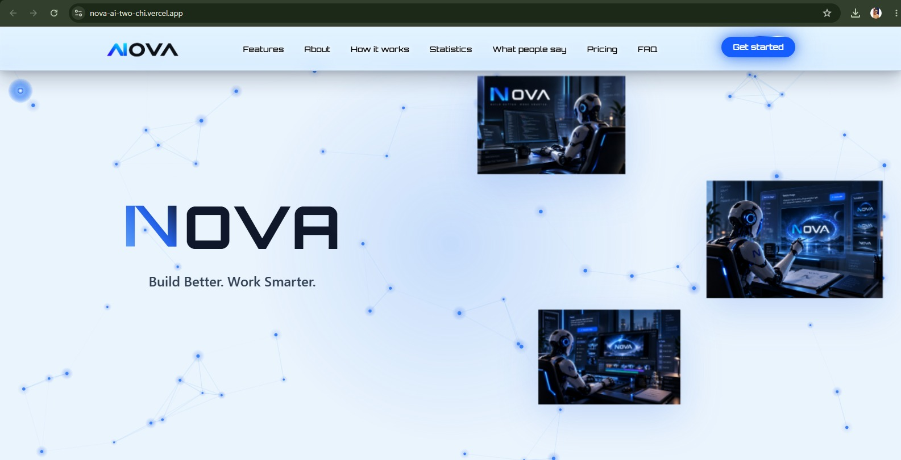
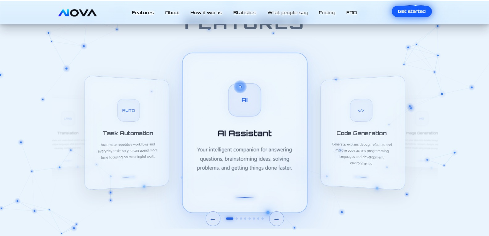
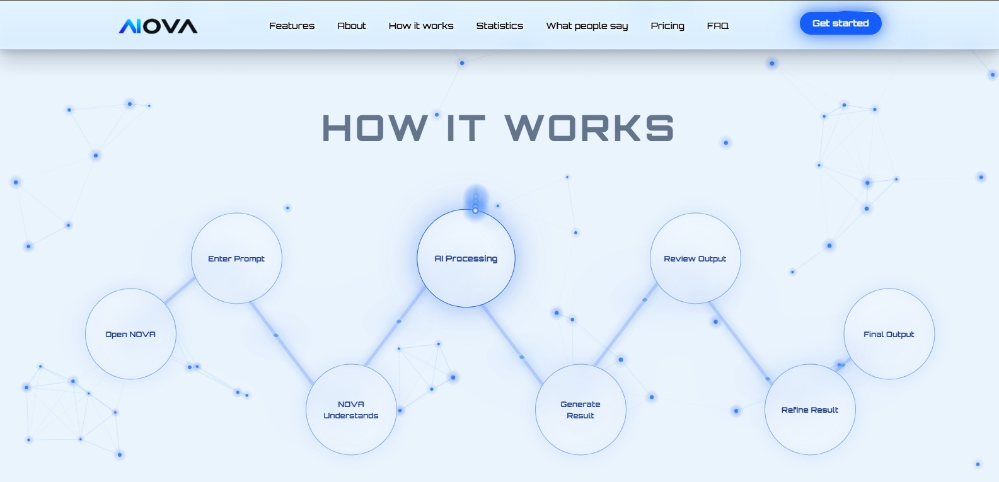
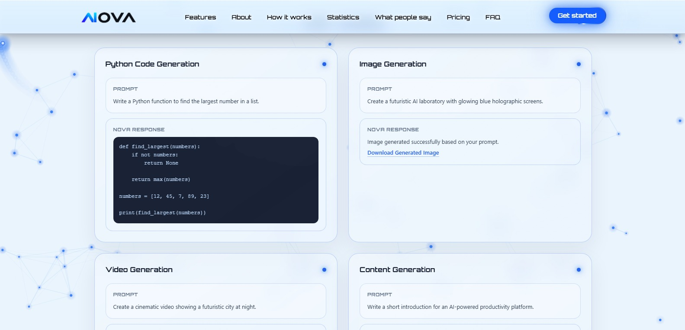
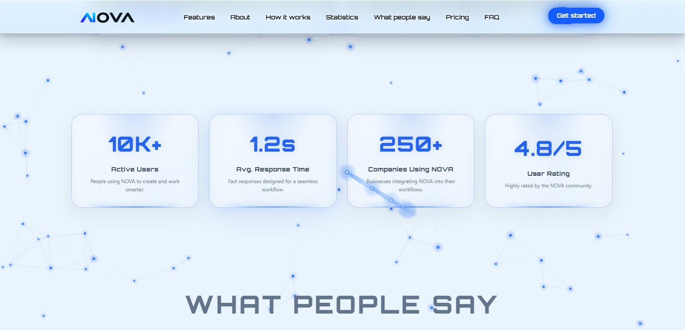
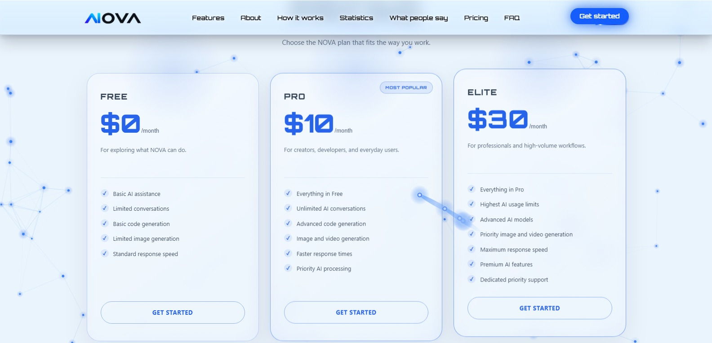
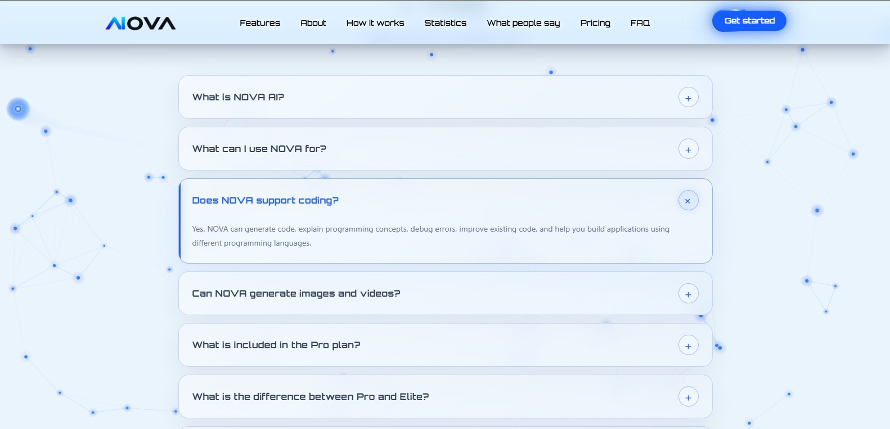
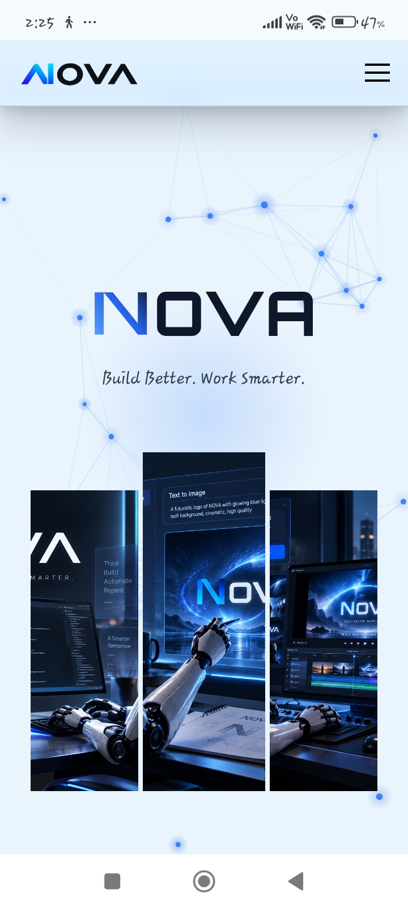
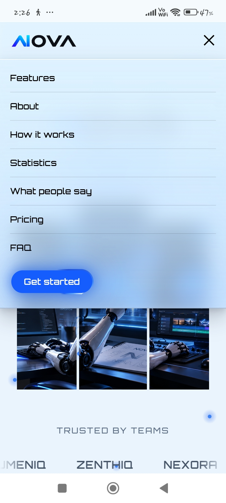
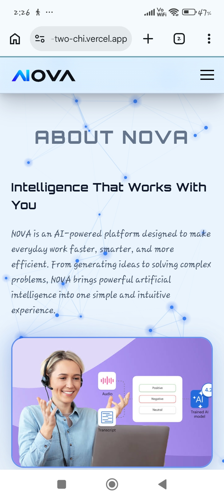
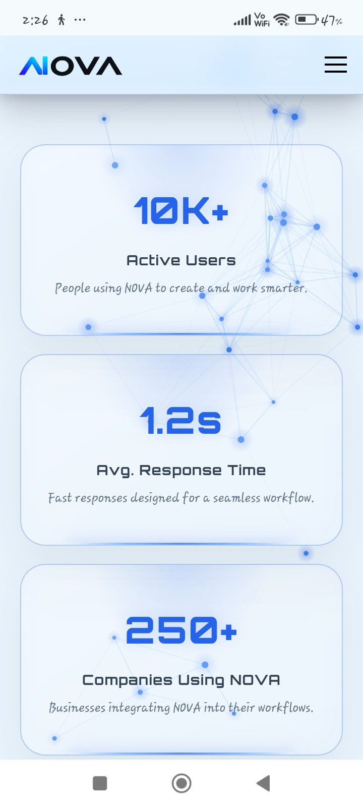
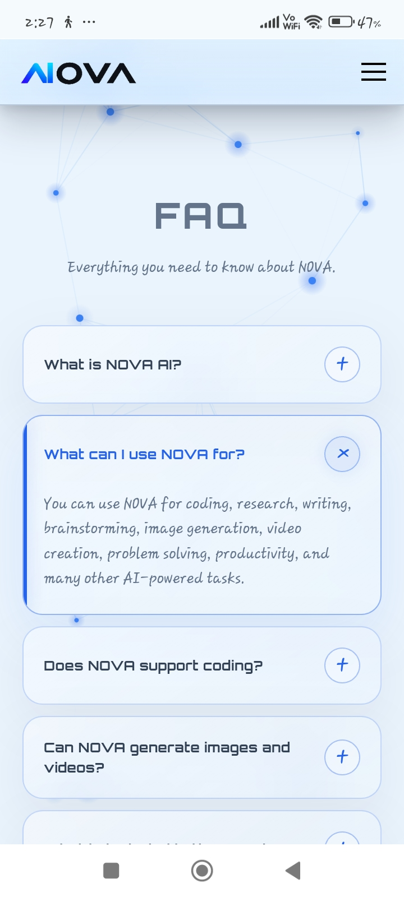
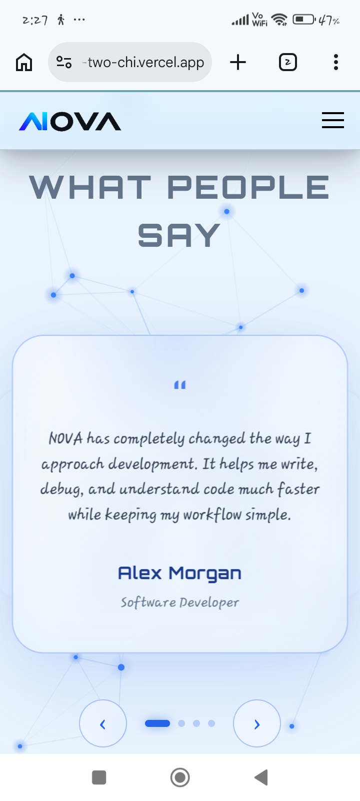


## Live Demo URL

[nova-ai-two-chi.vercel.app](https://nova-ai-two-chi.vercel.app/)

## AI Tool Used

* CLAUDE (Sonnet 5) :- Claude played a significant role in translating my initial concept into a polished and functional frontend. Starting from my basic outline, design ideas, and desired user interface, it helped bring the overall vision to reality with minimal prompting.

* ChatGPT:- ChatGPT helped me maintain consistency with the established design language of the project while developing the remaining sections. It assisted in creating new components that followed the same visual style, layout, color palette, typography, animations, and interactive elements, ensuring that every section felt cohesive.


## File Structure

```text
    NOVA-AI/
    │
    ├── node_modules/             # Project dependencies
    │
    ├── public/                   # Public assets
    │   ├── About-1.jpeg
    │   ├── About-2.jpeg
    │   ├── About-3.jpeg
    │   ├── aiova-logo-1.png
    │   ├── aiova-logo.png
    │   ├── Hero_img_1.png
    │   ├── Hero_img_2.png
    │   └── Hero_img_3.png
    │
    ├── src/
    │   ├── assets/
    │   │
    │   ├── components/           # Reusable UI components
    │   │   ├── Body.jsx
    │   │   ├── Footer.jsx
    │   │   └── Header.jsx
    │   │
    │   ├── pages/                # Application pages
    │   │   └── Landing.jsx
    │   │
    │   ├── Sections/             # Landing page sections
    │   │   ├── About.jsx
    │   │   ├── Faq.jsx
    │   │   ├── Features.jsx
    │   │   ├── Hero.jsx
    │   │   ├── Howitworks.jsx
    │   │   ├── Pricing.jsx
    │   │   ├── Statistics.jsx
    │   │   ├── Trustedby.jsx
    │   │   └── Whatpeoplesay.jsx
    │   │
    │   ├── App.jsx
    │   ├── App.css
    │   ├── index.css
    │   └── main.jsx
    │
    ├── index.html
    ├── package.json
    ├── vite.config.js
    ├── .gitignore
    └── README.md
```


## Challenges Faced

* Creating an attractive and visually engaging UI make achieving full responsiveness across different screen sizes significantly more challenging.

* Implementing complex animations was challenging, particularly when fine-tuning their timing, positioning, responsiveness, and interactions across different screen sizes.

